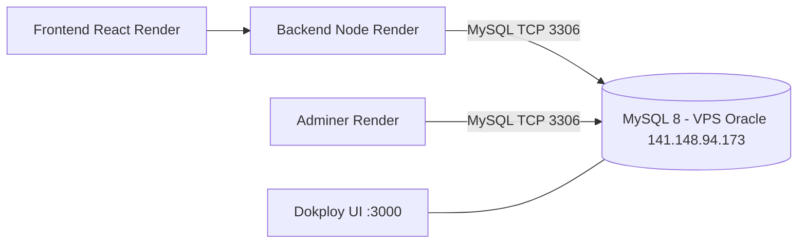

# ☁️ Infraestructura VPS — Oracle Cloud + Dokploy (Base de Datos MySQL)

> En este documento se describe la infraestructura de la base de datos de producción de
> MetaFit, **migrada** desde el contenedor embebido de Render hacia un **MySQL 8** corriendo
> en el VPS de Oracle Cloud y administrado por **Dokploy**.

---

## 1. Diagrama de arquitectura

```
                          ┌─────────────────────────────────────────────┐
                          │                 ORACLE CLOUD VPS             │
                          │                    141.148.94.173            │
                          │                                             │
 ┌──────────────┐  HTTPS  │  ┌───────────────────────────────────────┐  │
 │  Render      │────────▶│  │  Dokploy (http://141.148.94.173:3000) │  │
 │  ┌─────────┐ │         │  │  ┌───────────────────────────────────┐ │  │
 │  │ Frontend│ │         │  │  │ Compose: metafit-db               │ │  │
 │  │ (Vite)  │ │         │  │  │  image: mysql:8                   │ │  │
 │  └────┬────┘ │         │  │  │  ports: 3306:3306                 │ │  │
 │  ┌────┴────┐ │  MySQL   │  │  │  DB: metafit  / user: metafit    │ │  │
 │  │ Backend │────────────┼─▶│  │  Volume: metafit_mysql_data      │ │  │
 │  │ (Node)  │ │ TCP 3306 │  │  └───────────────────────────────────┘ │  │
 │  └─────────┘ │         │  │                                         │  │
 └──────────────┘         │  └───────────────────────────────────────┘  │
                          │                                             │
                          │  Adminer (Render) ─────▶ 141.148.94.173:3306│
                          │  https://metafit-adminer.onrender.com       │
                          └─────────────────────────────────────────────┘
```



---

## 2. Datos de conexión del VPS

| Campo | Valor |
|---|---|
| **IP pública** | `141.148.94.173` |
| **Puerto MySQL** | `3306` |
| **Usuario BD** | `metafit` |
| **Contraseña BD** | `Admin123!` |
| **Base de datos** | `metafit` |
| **URL Dokploy** | `http://141.148.94.173:3000` |
| **Puerto Dokploy** | `3000` |
| **Usuario SSH** | `opc` |

> ⚠️ El puerto 3306 debe estar abierto en el Security List de Oracle Cloud (y en el firewall
> del SO, p.ej. `sudo firewall-cmd --add-port=3306/tcp --permanent` si usás firewalld, o UFW
> con `sudo ufw allow 3306`). Ya fue verificado con un `SELECT 1` desde afuera.

---

## 3. Comandos para conectarse por SSH y ver los contenedores

```bash
# 1) SSH al VPS (la clave privada debe estar en el PC, p.ej. ~/.ssh/id_rsa)
ssh opc@141.148.94.173

# 2) Ver los contenedores de Docker (Dokploy levanta los servicios con Docker)
sudo docker ps --format "table {{.Names}}\t{{.Image}}\t{{.Ports}}\t{{.Status}}"

# 3) Ver los proyectos/compose de Dokploy
sudo docker compose ls

# 4) Logs del contenedor MySQL
sudo docker logs <container_name> --tail 100

# 5) Entrar a un shell MySQL dentro del contenedor
sudo docker exec -it <container_name> mysql -u root -pAdmin123! metafit
```

---

## 4. Cómo hacer un backup de la BD del VPS

```bash
# Opción A — desde el VPS (dentro del contenedor MySQL)
sudo docker exec <mysql_container> mysqldump -u root -pAdmin123! --single-transaction --routines --triggers metafit > metafit_backup_vps.sql

# Opción B — desde el PC (MySQL remoto, recomendado por simpleza)
docker run --rm -it mysql:8 mysqldump -h 141.148.94.173 -P 3306 -u metafit -pAdmin123! --single-transaction --routines --triggers metafit > metafit_backup_vps.sql

# Restaurar ese backup
docker run --rm -i mysql:8 mysql -h 141.148.94.173 -P 3306 -u root -pAdmin123! metafit < metafit_backup_vps.sql
```

---

## 5. Cómo migrar datos en el futuro (Local → VPS)

```bash
# 5.1 Exportar la BD LOCAL (contenedor MariaDB del docker-compose)
docker exec -i metafit_db mariadb-dump -u root -pAdmin123! --single-transaction --routines --triggers --events metafit > metafit_backup.sql

# 5.2 Adaptar el dump MariaDB → MySQL 8 (si la fuente es MariaDB)
#     - reemplazar COLLATE=utf8mb4_uca1400_ai_ci  por  COLLATE=utf8mb4_0900_ai_ci
#     - reemplazar DEFAULT curdate()              por  DEFAULT (curdate())
#     - reemplazar current_timestamp()            por  CURRENT_TIMESTAMP
#     (ej. con PowerShell: [IO.File]::WriteAllText(dest, content.Replace(...), UTF8-sin-BOM))

# 5.3 Importar en el VPS (con root para respetar los DEFINER de las vistas)
docker run --rm -i mysql:8 mysql -h 141.148.94.173 -P 3306 -u root -pAdmin123! metafit < metafit_backup_mysql8.sql

# 5.4 Verificar conteos
docker run --rm mysql:8 mysql -h 141.148.94.173 -P 3306 -u metafit -pAdmin123! metafit \
  -e "SELECT COUNT(*) FROM USUARIO; SELECT COUNT(*) FROM AFILIADO;"
```

Migración realizada el **2026-09-22**: `USUARIO 13`, `AFILIADO 8`, **25 tablas** (incluye
5 vistas de cálculos) — coinciden con la BD local.

---

## 6. Administración del servicio en Dokploy

- **Proyecto**: `metafit` → environment `production`.
- **Servicio**: `metafit-db` — tipo **Compose** (la API `mysql.create` de Dokploy no admite el
  carácter `!` en las contraseñas, por eso se creó como Compose con la imagen oficial `mysql:8`
  y las mismas env vars).
- **Config**:
  - imagen `mysql:8`
  - `MYSQL_ROOT_PASSWORD=Admin123!`
  - `MYSQL_DATABASE=metafit`
  - `MYSQL_USER=metafit`
  - `MYSQL_PASSWORD=Admin123!`
  - puerto `3306:3306`
  - volumen `metafit_mysql_data` para persistencia
- El `docker-compose.yml` del repo incluye un servicio `dokploy-db-remote` **solo documentación**
  (profile `documentation-only`) que refleja esa misma configuración.